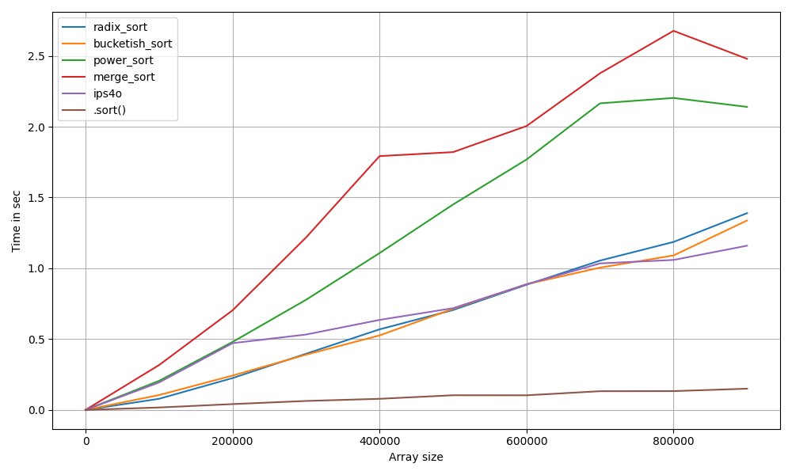

# This repo can halp you to compare different sorting algorithms

### !!! This project works only on [python 3.14](https://www.python.org/downloads/)

⭐ Link to the original [ips4o algo](https://github.com/SaschaWitt/ips4o/blob/master/ips4o/utils.hpp). thx, guys

The only useful thing you can change in [main.py](src/main.py) is this line 

`sizes = list(range(0, 1_000_000, 100_000))`

Also in [ips4.py](src/ips4.py) there is `max_workers: int | None = 10000,`

### ⭐ That is all, have fun

oh, sorry, I forgor
```bash
pip install -r requirements.txt
```
## Some results on default settings


